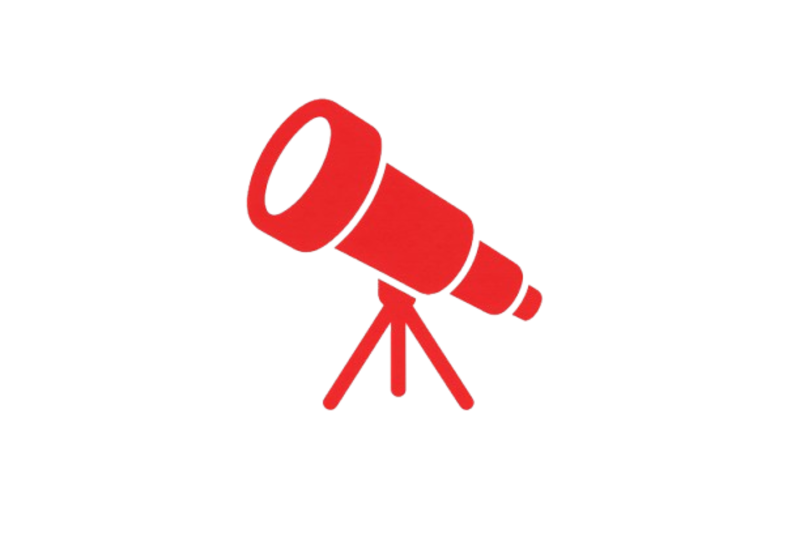
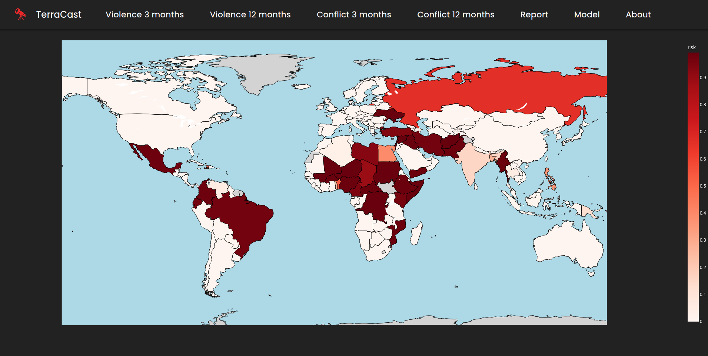
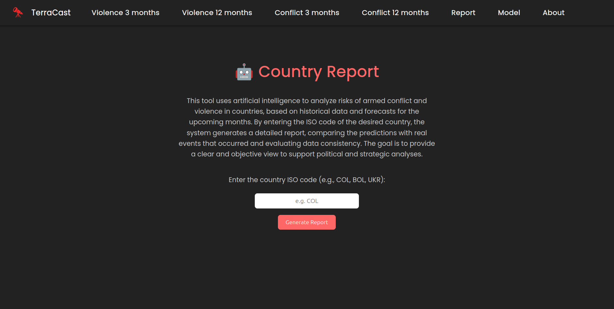
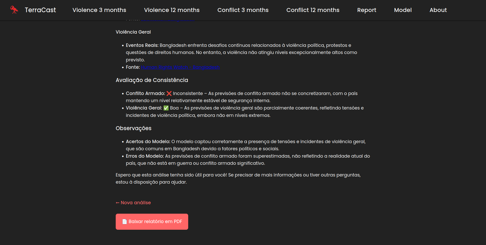

# TerraCast

  

---

## 📌 Description

**TerraCast** is a predictive intelligence platform specialized in anticipating **armed conflicts and geopolitical instability** on a global scale.  
By leveraging advanced **Artificial Intelligence**, statistical modeling, and **machine learning**, we transform complex data into actionable strategic insights.

Our system analyzes thousands of indicators — economic, social, political, environmental, and behavioral — to identify **risk patterns** and forecast conflict scenarios up to **12 months in advance**.  
These forecasts support governments, international organizations, security firms, and humanitarian agencies in informed decision-making, reducing uncertainty and helping save lives.

---

## 🚀 Mission

Anticipate crises before they turn into tragedies.  
Deliver data-driven intelligence to promote a **safer, more transparent, and better-prepared world**.

---

## 🌎 Vision

To become a global reference in **predictive geopolitical risk technology**, contributing to **conflict prevention** and the development of **sustainable peace strategies**.

---

## ✨ Differentiators

- Proprietary AI models calibrated with historical and continuously updated data.  
- A multidisciplinary team with expertise in data science, international politics, and security.  
- Integration with open sources, financial indices, media, and generative AI for **automated report generation**.

---

## 🛠️ Platform Features

- Interactive risk maps for **violence and conflict** at 3- and 12-month horizons.  
- Automated reports on conflict and violence forecasts.  
- Predictive models continuously updated with new data sources.

---

## 🏠 Home Page

When accessing the TerraCast platform, users are greeted with an **interactive global risk map**, highlighting levels of violence and conflict across countries.

### 🔹 How to interpret the map

- **Darker colors (deep red)** → high risk of conflict or violence  
- **Lighter colors (light red / white)** → low risk or stability  
- **Side legend** → indicates risk values from 0 (low) to 1 (high)

### 🔹 Main Home features

- Global visualization of current risk for **3 months** and **12 months**  
- Navigation between **Violence** and **Conflict** with interactive filters  
- Automatic data updates as new forecasts are processed  
- Quick access to other sections:  
  - **Report** → detailed reports  
  - **Model** → predictive model information  
  - **About** → mission, vision, and team information

> The home page serves as the starting point for exploring risk maps and obtaining strategic insights in a visual and intuitive way.

---

## 📄 Report

The TerraCast Report tab allows users to generate detailed analyses of armed conflict and violence risk across different countries, using artificial intelligence and historical data. The goal is to provide an objective and consistent perspective to support political and strategic analysis.

### 🔹 Core functionality

**Custom Report Generation**: By entering a country’s ISO code (for example, COL for Colombia, BOL for Bolivia, or UKR for Ukraine), the system generates a detailed report comparing forecasts with real-world events, assessing data consistency using ChatGPT technology.

### 🔹 Report download

Once the report is generated, users can download the text produced by ChatGPT to their local machine. Since the analysis is not stored, it will be lost if a new report is requested. Simply click the **"Download report as PDF"** button.

---

## 📜 License

  

This project is licensed under the [Creative Commons Attribution-NonCommercial-ShareAlike 4.0 International License](LICENSE).

