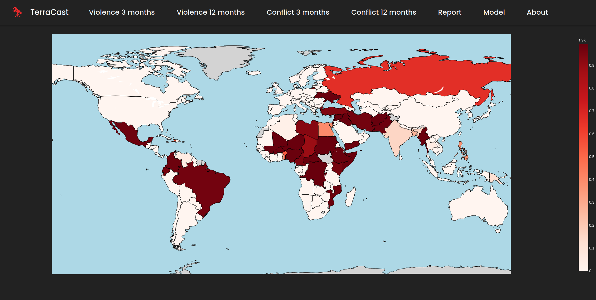
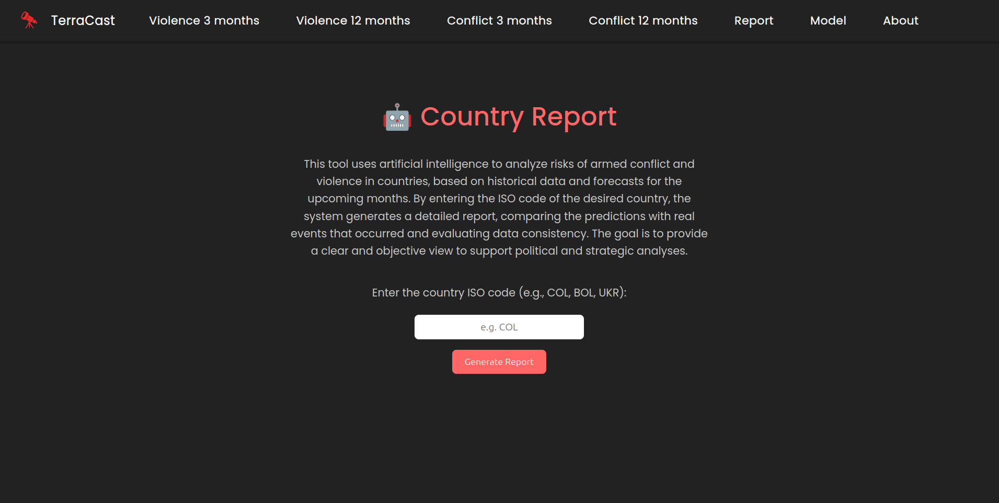
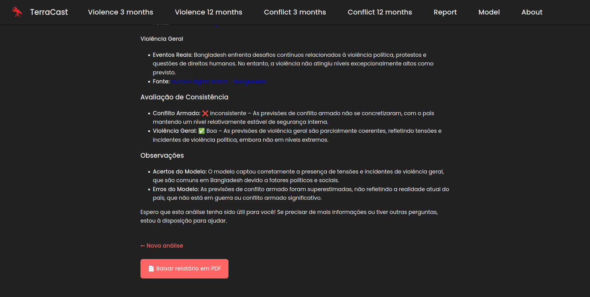

# TerraCast

  

---

## 📌 Descrição

**TerraCast** é uma plataforma de inteligência preditiva especializada em antecipar **conflitos armados e instabilidades geopolíticas** em escala global.  
Utilizando tecnologias avançadas de **Inteligência Artificial**, modelagem estatística e **machine learning**, transformamos dados complexos em insights estratégicos acionáveis.

Nosso sistema analisa milhares de indicadores — econômicos, sociais, políticos, ambientais e comportamentais — para identificar **padrões de risco** e prever cenários de conflito com até **12 meses de antecedência**.  
Essas previsões auxiliam governos, organizações internacionais, empresas de segurança e agências humanitárias na tomada de decisões informadas, reduzindo incertezas e salvando vidas.

---

## 🚀 Missão

Antecipar crises antes que se tornem tragédias.  
Fornecer inteligência baseada em dados para promover um mundo **mais seguro, transparente e preparado**.

---

## 🌎 Visão

Ser referência mundial em tecnologia de **risco geopolítico preditivo**, contribuindo para **prevenção de conflitos** e construção de estratégias de **paz sustentável**.

---

## ✨ Diferenciais

- Modelos proprietários de IA calibrados com dados históricos e atualizados.  
- Cobertura global, com previsões subnacionais e mapas interativos de risco.  
- Equipe multidisciplinar, com pesquisadores em ciência de dados, política internacional e segurança.  
- Integração com fontes abertas, índices financeiros, mídias e IA generativa para **produção automatizada de relatórios**.

---

## 🛠️ Funcionalidades da Plataforma

- Mapas interativos de risco para **violência e conflito** em 3 e 12 meses.  
- Relatórios automatizados sobre previsões de conflito e violência.  
- Modelos preditivos atualizados constantemente com novas fontes de dados.  

## 🏠 Página Inicial / Home

Ao acessar a plataforma TerraCast, você será recebido com um **mapa interativo de risco global**, destacando os níveis de violência e conflito em diferentes países.  

### 🔹 Como interpretar o mapa

- **Cores escuras (vermelho intenso)** → alto risco de conflito ou violência  
- **Cores claras (vermelho claro / branco)** → baixo risco ou estabilidade  
- **Legenda lateral** → indica valores de risco de 0 (baixo) a 1 (alto)

### 🔹 Funcionalidades principais da Home

- Visualização global do risco atual para **3 meses** e **12 meses**  
- Navegação entre **Violência** e **Conflito** com filtros interativos  
- Atualização automática dos dados conforme novas previsões são processadas  
- Acesso rápido às demais seções:  
  - **Report** → relatórios detalhados  
  - **Model** → informações sobre os modelos preditivos  
  - **About** → informações sobre a missão, visão e equipe

> A página inicial serve como ponto de partida para explorar os mapas de risco e obter insights estratégicos de maneira visual e intuitiva.

## 📄  Report

A aba Report do TerraCast permite gerar análises detalhadas sobre o risco de conflitos armados e violência em diferentes países, utilizando inteligência artificial e dados históricos. O objetivo é fornecer uma visão objetiva e consistente para apoiar análises políticas e estratégicas.

### 🔹 A funcionalidade principal

Geração de Relatórios Personalizados: Ao inserir o código ISO de um país (por exemplo, COL para Colômbia, BOL para Bolívia ou UKR para Ucrânia), o sistema cria um relatório detalhado que compara previsões com eventos reais ocorridos, avaliando a consistência dos dados, utilizando-se da tecnologia do ChatGPT.

### 🔹 Download do relatório

Após gerado o relatório, o usuário pode baixar em sua máquina o texto gerado pelo ChatGPT, pois uma vez feita a análise, ela será perdida no caso de um novo relatório a ser requisitado. Basta apertar o botão **"Baixar relatório em PDF"**
